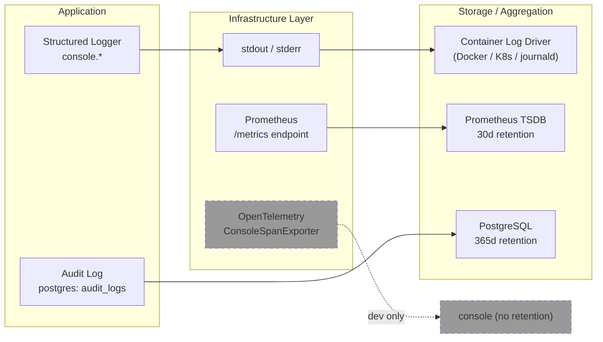

# Log Retention Policy

How long each log type is kept and where.

**Audience:** Operators responsible for log infrastructure, capacity planning, and compliance.

---

## Overview

The Credence backend emits several distinct categories of diagnostic and audit data.
Only one category (audit logs) is retained inside the application itself. All other
log types are written to stdout/stderr and rely on the container orchestration layer
(Docker log driver, Kubernetes log rotation, or your system's `logrotate`) for
retention and rotation.



---

## Log Types

### 1. Application Logs (stdout / stderr)

| Field | Detail |
|-------|--------|
| **Source** | `src/utils/logger.ts` — custom structured JSON logger |
| **Output** | `console.log` / `console.error` / `console.warn` / `console.debug` |
| **Format** | JSON lines, one object per line |
| **Volume guidance** | ~1-5 KB per request (varies with payload size) |
| **Retention** | **Not configured in the application.** Managed by the container runtime. |

Every log line includes these envelope fields:

```json
{"level":"INFO","timestamp":"2026-07-25T12:00:00.000Z","requestId":"req_abc","correlationId":"corr_def","route":"/api/bonds","tenant":"tenant-1","actor":"user-1","message":"bond_created"}
```

**Level gating:**
- `DEBUG` messages are only emitted when `process.env.DEBUG === "true"` or `NODE_ENV === "development"`.
- `INFO` / `WARN` / `ERROR` are always emitted.

**Relevant env vars:**

| Variable | Default | Effect |
|----------|---------|--------|
| `LOG_LEVEL` | `info` | Parsed but **not yet consumed** by the logger; retained for future use. |
| `DEBUG` | — | When `"true", enables DEBUG-level output. |
| `NODE_ENV` | `development` | When `"development"`, enables DEBUG-level output. |

**Infrastructure recommendations:**

| Platform | Mechanism |
|----------|-----------|
| Docker | `docker logs --tail N` or configure `log-opts` in `daemon.json` (`max-size`, `max-file`). Compose example: `logging: driver: "json-file" options: { max-size: "10m", max-file: "3" }` |
| Kubernetes | Configure `kubelet` log rotation or use a sidecar log-shipper (Fluentd, Fluent Bit, Vector) with retention rules on the aggregator side. |
| Systemd | `journalctl --vacuum-time=30d` or `--vacuum-size=1G` to cap journald retention. |

#### Sub-types that flow through the same stdout/stderr channel

| Log sub-type | Trigger | Sample |
|---|---|---|
| Request logs | Every HTTP request (via `req.log`) | `{"message":"bond_accessed","bondId":"bond-001"}` |
| Outbox publisher | Background job cycles | `{"message":"[OutboxPublisher] Starting","config":{…}}` |
| Slow queries | Queries exceeding `SLOW_QUERY_THRESHOLD_MS` (default 1000 ms) | Attaches `EXPLAIN` plan to log entry |
| Background jobs | Scheduled sweeps, reconciliation runs | `{"message":"[SettlementReconciler] Starting reconciliation run"}` |

---

### 2. Audit Logs (PostgreSQL `audit_logs` table)

| Field | Detail |
|-------|--------|
| **Source** | `src/services/audit/index.ts` — `AuditLogService` |
| **Storage** | PostgreSQL `audit_logs` table with SHA-256 hash chain |
| **Retention** | **365 days** (configurable) |
| **Cleanup** | `DataRetentionJob` (`src/jobs/dataRetentionJob.ts`) runs on a schedule and deletes rows older than the TTL. |
| **Export** | `GET /api/admin/audit-logs/export` — NDJSON stream, capped at `AUDIT_EXPORT_MAX_WINDOW_DAYS=90`. |

**Config:**

| Variable | Default | Description |
|----------|---------|-------------|
| `RETENTION_TTL_AUDIT_LOGS_DAYS` | `365` | Age at which audit log rows are eligible for deletion by `DataRetentionJob`. Set to `0` to keep forever. |
| `AUDIT_EXPORT_MAX_WINDOW_DAYS` | `90` | Maximum time window (in days) for a single audit log export query. |

The audit log is **append-only** and hash-chained for tamper detection. Deletion is only
performed by the `DataRetentionJob` after the TTL window, and should be tested against a
restored backup before being enabled in production. See [docs/audit-log.md](audit-log.md)
for the full chain integrity specification.

Each audit row records: `actorId`, `actorEmail`, `action`, `resourceType`, `resourceId`,
`details`, `status`, `ipAddress`, `requestId`, `tenantId`, and chain fields (`seq`,
`prevHash`, `rowHash`).

---

### 3. Prometheus Metrics

| Field | Detail |
|-------|--------|
| **Source** | `src/middleware/metrics.ts` — `prom-client` registry |
| **Output** | Exposed at `GET /metrics` for Prometheus scraping |
| **Retention (local dev)** | **30 days** / **10 GB** (configured in `docker-compose.yml`) |
| **Retention (production)** | Determined by your Prometheus server configuration (`--storage.tsdb.retention.time` / `--storage.tsdb.retention.size`) |

Metrics are pull-based (Prometheus scrapes the `/metrics` endpoint). There is no
pushgateway. The exported metric families cover:

- HTTP request latency, status codes, active requests
- Soroban RPC latency, circuit breaker state, cache hit rates
- Outbox publisher: events published, failed, quarantined, pending, lease renewals
- DB pool: active/idle/waiting clients, slow query count
- Webhook delivery latency, payload sizes, DLQ depth
- WebSocket: active connections, auth failures, backpressure drops
- Horizon listener: stream status, cursor state

---

### 4. OpenTelemetry Traces

| Field | Detail |
|-------|--------|
| **Source** | `src/tracing/tracer.ts` — `NodeTracerProvider` |
| **Output** | `ConsoleSpanExporter` (dev default) — writes spans to stdout |
| **Retention** | **Not retained.** The dev exporter writes to stdout, which follows application log retention. Production deployments should swap to an OTLP exporter (e.g., Jaeger, Grafana Tempo) with their own retention policy. |

Spans are created in the payment pipeline, reputation scoring, database transactions,
and outbox event publishing.

---

## Quick Reference

| Log type | Where it lives | Default retention | Configurability |
|----------|---------------|-------------------|-----------------|
| Application logs (stdout) | Container runtime (Docker/K8s/journald) | Unbounded (managed externally) | `max-size` / `max-file` / `logrotate` |
| Audit logs | PostgreSQL `audit_logs` | 365 days | `RETENTION_TTL_AUDIT_LOGS_DAYS` |
| Prometheus metrics | Prometheus TSDB (local) | 30 days / 10 GB | `--storage.tsdb.retention.*` flags |
| OpenTelemetry traces | stdout (dev) / OTLP destination (prod) | None (dev) / depends on backend | Swap exporter in `src/tracing/tracer.ts` |

## Related

- **[Structured Logging Policy](LOGGING.md)** — how to write log entries, reserved keys, PII redaction
- **[Audit Log Specification](audit-log.md)** — hash chain integrity, export, and verification
- **[Observability](observability.md)** — metrics, tracing, and monitoring infrastructure
- **[Data Retention Configuration](../src/config/retention.ts)** — source of truth for entity TTLs
