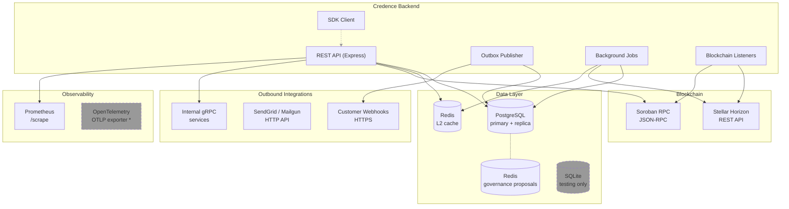

# Downstream Service Map

Every external service the Credence backend calls at runtime, why it calls it, and how the connection is configured.

**Audience:** Contributors adding or modifying code that reaches an external dependency. Use this map to understand what is available, which client to use, and what configuration each connection needs.

---

## Dependency Overview



> \* The OpenTelemetry OTLP exporter is not wired in the default configuration; the
> dev setup uses `ConsoleSpanExporter`. Production deployments should swap in an
> OTLP exporter. SQLite is used only in local development and test suites.

---

## 1. PostgreSQL

| Attribute | Value |
|-----------|-------|
| **Purpose** | Primary data store. All domain entities, outbox events, webhook configs, audit logs, cursor state, cache invalidation bus. |
| **Client** | `pg` (npm `pg` v8) — `Pool` |
| **Pools** | `pool` (API routes), `workerPool` (background jobs), `replicaPool` (read-replica queries) |
| **Source** | `src/db/pool.ts:102‑138` |
| **Health** | `src/services/health/probes.ts` — runs `SELECT 1` |
| **Env vars** | `DB_URL` (required), `DB_REPLICA_URL` (optional), `DB_POOL_MAX`, `DB_POOL_IDLE_TIMEOUT_MS`, `DB_POOL_CONNECTION_TIMEOUT_MS`, `DB_STATEMENT_TIMEOUT_MS`, `SLOW_QUERY_THRESHOLD_MS`, `MAX_REPLICA_LAG_MS` |

Usage pattern — repositories accept a `Queryable` (pool or client) and run SQL directly:

```
src/db/repositories/
├── identityRepository.ts
├── bondsRepository.ts
├── webhookRepository.ts
├── settlementRepository.ts
├── failedInboundEventsRepository.ts
└── … (~28 repositories)
```

The `pg` pool is also the transport for the cross-instance cache invalidation bus (`src/cache/invalidationBus.ts`), which uses `LISTEN`/`NOTIFY`.

---

## 2. Redis (L2 Cache)

| Attribute | Value |
|-----------|-------|
| **Purpose** | Distributed L2 cache for Soroban state, trust scores, bonds, attestations. L1 is an in-process LRU cache (`lru-cache`). |
| **Client** | `redis` v5 (`createClient`) |
| **Source** | `src/cache/redis.ts` — `CacheService` class. `RedisConnection` singleton. |
| **Health** | `src/services/health/probes.ts` — runs `PING` |
| **Env vars** | `REDIS_URL` (required, `redis://…` format) |

Cache keys are namespaced by entity type. Every `cache.get()` / `cache.set()` call goes through the `CacheService`:

```typescript
// src/cache/redis.ts — CacheService
const cached = await cache.get<FailedInboundEvent>('failed_event', id)
await cache.set('failed_event', id, event, TTL_SECONDS)
```

Invalidation propagates across instances via `pg_notify` (`src/cache/invalidationBus.ts`).

---

## 3. Redis (Governance Proposals)

| Attribute | Value |
|-----------|-------|
| **Purpose** | Stores governance / multisig proposals. Separate from the L2 cache Redis. |
| **Client** | `ioredis` v5 |
| **Source** | `src/services/governance/redisStorage.ts` — `RedisProposalStorage` |
| **Health** | Probed via the optional `QUEUE_URL` health check |
| **Env vars** | `QUEUE_URL` (optional) |

---

## 4. Stellar Horizon

| Attribute | Value |
|-----------|-------|
| **Purpose** | Reads blockchain state and streams on-chain events (bond creation, withdrawals). Also used for settlement reconciliation. |
| **Client** | `@stellar/stellar-sdk` v14 — `Horizon.Server` |
| **Source** | `src/listeners/horizonBondEvents.ts` (SSE stream), `src/listeners/horizonWithdrawalEvents.ts` (polling), `src/jobs/settlementReconciler.ts`, `src/services/replayService.ts` |
| **Health** | Circuit-breaker probe in `src/services/health/probes.ts` |
| **Env vars** | `HORIZON_URL` (default `https://horizon-testnet.stellar.org`), `STELLAR_NETWORK_PASSPHRASE` |

SSE stream for bond creation:

```typescript
// src/listeners/horizonBondEvents.ts
const sse = server.operations().forAccount(bondCreationAccount)
  .cursor('now')
  .stream({ onmessage: handleOperation })
```

Polling for withdrawal events:

```typescript
// src/listeners/horizonWithdrawalEvents.ts
const res = await server.operations().forLedger(seq).limit(200).call()
```

---

## 5. Soroban RPC

| Attribute | Value |
|-----------|-------|
| **Purpose** | Reads identity state from Soroban smart contracts and fetches contract-scoped events. |
| **Client** | Native `fetch()` — JSON-RPC 2.0 over HTTP POST |
| **Source** | `src/clients/soroban.ts` — `SorobanClient.callRpc()`. Wrapped with circuit-breaker (`src/clients/circuitBreaker.ts`) and L1/L2 cache (`src/clients/sorobanStateCache.ts`). |
| **Health** | Circuit-breaker state reported via `prom-client` gauges |
| **Env vars** | `SOROBAN_RPC_URL` (or configured per-instance), `TIMEOUT_SOROBAN_MS`, circuit-breaker env vars |

Retry with exponential backoff:

```typescript
// src/clients/soroban.ts
const response = await fetch(this.rpcUrl, {
  method: 'POST',
  headers: { 'Content-Type': 'application/json' },
  body: JSON.stringify({ jsonrpc: '2.0', method, params, id }),
  signal: AbortSignal.timeout(timeoutMs),
})
```

---

## 6. Customer Webhooks

| Attribute | Value |
|-----------|-------|
| **Purpose** | Delivers bond lifecycle events (`bond.created`, `bond.slashed`, `bond.withdrawn`, `attestation.*`, `score.updated`, `credits.low`) to subscriber-registered HTTPS endpoints. |
| **Client** | Native `fetch()` — HMAC-SHA256 signed payloads. Optional mTLS and cert pinning. |
| **Source** | `src/services/webhooks/delivery.ts` (delivery + retry), `src/services/webhooks/service.ts` (orchestration), `src/db/outbox/webhookPublisher.ts` (outbox → publisher bridge) |
| **Health** | DLQ depth reported via prometheus counters |
| **Env vars** | `TIMEOUT_WEBHOOK_MS`, `OUTBOUND_RETRY_WEBHOOK_MAX_ATTEMPTS`, `OUTBOUND_RETRY_WEBHOOK_BASE_DELAY_MS`, `OUTBOUND_RETRY_WEBHOOK_MAX_DELAY_MS`, `OUTBOUND_RETRY_WEBHOOK_MULTIPLIER`, `OUTBOUND_RETRY_WEBHOOK_JITTER` |

Delivery happens in the outbox publisher background job:

```
outbox event → OutboxPublisher.processBatch()
            → webhookPublisher.handle() → delivery.ts → fetch(endpoint)
```

SSRF protection is applied via `src/lib/ssrfProtection.ts` — it blocks loopback, link-local, and private IP ranges.

---

## 7. Email Providers (SendGrid / Mailgun)

| Attribute | Value |
|-----------|-------|
| **Purpose** | Sends transactional email notifications with automatic failover between providers. |
| **Client** | Native `fetch()` — `SendGridProvider` hits `POST https://api.sendgrid.com/v3/mail/send`, `MailgunProvider` hits `POST https://api.mailgun.net/v3/{domain}/messages` |
| **Source** | `src/services/notifications/providers.ts`, `src/services/notifications/service.ts`, `src/services/notifications/delivery.ts` |
| **Health** | `src/services/notifications/health.ts` |
| **Env vars** | API keys are injected at provider instantiation (no single env-var schema — configure per deployment) |

```typescript
// src/services/notifications/providers.ts
class SendGridProvider implements NotificationProvider {
  async send(notification: Notification): Promise<DeliveryResult> {
    const res = await fetch('https://api.sendgrid.com/v3/mail/send', {
      method: 'POST',
      headers: { Authorization: `Bearer ${this.apiKey}`, 'Content-Type': 'application/json' },
      body: JSON.stringify(buildSendGridPayload(notification)),
    })
    // …
  }
}
```

---

## 8. Internal gRPC Services

| Attribute | Value |
|-----------|-------|
| **Purpose** | Typed RPC calls to other Credence internal services (trust, bond, attestation, verification, governance). |
| **Client** | `@connectrpc/connect` + `@connectrpc/connect-node` v2 over HTTP/2. Protobuf definitions in `proto/credence/v1/`. |
| **Source** | `src/sdk/grpc/client.ts` (factory), `src/sdk/grpc/interceptors.ts` (auth, deadline, tracing) |
| **Env vars** | `GRPC_BASE_URL`, `GRPC_INTERNAL_SECRET` (shared HMAC secret) |

Every outbound call carries a shared-secret auth header and a per-method deadline:

```typescript
// src/sdk/grpc/client.ts
const transport = createConnectTransport({
  baseUrl: grpcBaseUrl,
  httpVersion: '2',
  interceptors: [authInterceptor(secret), deadlineInterceptor(defaultDeadlineMs)],
})
```

---

## 9. Credence Public API (Self-consumption SDK)

| Attribute | Value |
|-----------|-------|
| **Purpose** | Official TypeScript SDK that consumes Credence's own REST API. |
| **Client** | Native `fetch()` with Bearer token auth and timeout via `AbortController`. |
| **Source** | `src/sdk/client.ts`, `src/sdk/types.ts` |
| **Env vars** | Configured at instantiation: `baseUrl`, `apiKey` |

```typescript
// src/sdk/client.ts
const client = new CredenceClient({ baseUrl: 'https://api.credence.dev', apiKey: process.env.CREDENCE_API_KEY })
const trust = await client.getTrustScore('GABCD…')
```

---

## 10. SQLite (Development / Test Only)

| Attribute | Value |
|-----------|-------|
| **Purpose** | Local development and in-memory test database. Never used in production. |
| **Client** | `better-sqlite3` v12 |
| **Source** | `src/db/connection.ts` |

---

## Observability (Inbound)

These are not downstream calls but are listed because they depend on external infrastructure.

### Prometheus

The application exposes a `/metrics` endpoint on the API server (`src/middleware/metrics.ts`). Prometheus scrapes this endpoint. Metrics include request latencies, Soroban RPC latencies, circuit breaker state, cache hit rates, pool metrics, and many more.

Env var: `METRICS_ALLOWED_CIDRS` (optional CIDR whitelist).

### OpenTelemetry

Tracing is initialised in `src/tracing/tracer.ts`. The default dev configuration uses `ConsoleSpanExporter`. For production, swap to an OTLP exporter. Spans are created in:

- `src/services/payment/orchestrator.ts` — payment pipeline
- `src/services/reputation/score.ts` — reputation scoring
- `src/db/outbox/emitter.ts` — outbox event emission
- `src/db/outbox/publisher.ts` — outbox event publishing

---

## Configuration Quick Reference

| Variable | Required | Default | Used By |
|----------|----------|---------|---------|
| `DB_URL` | Yes | — | PostgreSQL (all pools) |
| `REDIS_URL` | Yes | — | Redis L2 cache |
| `HORIZON_URL` | No | `https://horizon-testnet.stellar.org` | Stellar Horizon |
| `STELLAR_NETWORK_PASSPHRASE` | No | — | Horizon SDK |
| `GRPC_BASE_URL` | No | — | Internal gRPC |
| `GRPC_INTERNAL_SECRET` | No | — | Internal gRPC auth |
| `QUEUE_URL` | No | — | Governance proposal storage |
| `WEBHOOK_*` | No | (see webhooks.md) | Customer webhooks |
| `METRICS_ALLOWED_CIDRS` | No | — | Prometheus scrape access |
| `TIMEOUT_SOROBAN_MS` | No | — | Soroban RPC timeout |
| `SOROBAN_CIRCUIT_BREAKER_*` | No | (see soroban.ts) | Soroban circuit breaker |
| `DB_REPLICA_URL` | No | `DB_URL` | Read-replica pool |
| `DB_POOL_MAX` | No | `20` | PostgreSQL pool size |
| `SLOW_QUERY_THRESHOLD_MS` | No | `1000` | Slow-query logging |
