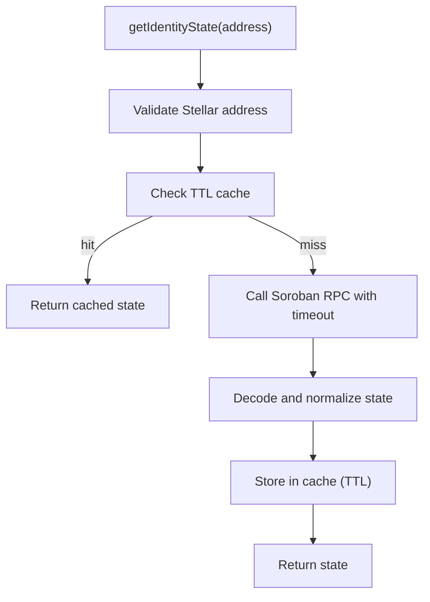

# Reputation Engine: On-Chain Reads and Score History

This document covers the new reputation engine capabilities:

- Soroban on-chain identity/bond state fetch service
- Event-driven score history persistence to Postgres

## On-Chain Fetch Service

Source: `src/services/reputation/onchain.ts`

### What it does

- Reads contract state from Soroban RPC for a Stellar identity address.
- Validates Stellar addresses before network calls.
- Enforces timeout on each RPC request.
- Maps failures into explicit `OnchainError` codes.
- Caches successful reads in memory with TTL.

### Public API

- `OnchainReputationService#getIdentityState(address)`
- `OnchainReputationService#clearCache(address?)`
- `OnchainError` codes:
  - `INVALID_ADDRESS`
  - `TIMEOUT`
  - `NETWORK_ERROR`
  - `DECODE_ERROR`
  - `RPC_ERROR`

### Configuration

`OnchainServiceOptions`:

- `rpcUrl`: Soroban RPC URL
- `contractId`: contract identifier
- `methodName`: contract read method (default: `get_identity_state`)
- `timeoutMs`: per-request timeout (default: `5000`)
- `cacheTtlMs`: in-memory TTL (default: `15000`)
- `rpcClient`: optional injected client (for testing/custom transport)

### Fetch flow



### Timeout and error behavior

- Timeouts are converted to `OnchainError(code='TIMEOUT')`.
- Transport-level failures are converted to `NETWORK_ERROR`.
- Invalid RPC payload/shape is converted to `DECODE_ERROR`.
- Other remote failures are converted to `RPC_ERROR`.
- Errors are **not cached**.

## Score History Persistence

Source: `src/services/reputation/scoreHistory.ts`

### What it does

- Builds score snapshots from event input.
- Buckets snapshots into configurable time windows.
- Persists snapshots to `score_history`.
- Prevents duplicates by logical window and event type.

### Public API

- `ScoreHistoryService#recordFromEvent(input)`
- `PgScoreHistoryRepository#upsertSnapshot(snapshot)`
- `createScoreHistorySyncHooks(historyService, scoreProvider)`

### Windowing and idempotency

- Window start is computed as: `floor(event_time / windowMs) * windowMs`.
- Snapshot uniqueness key: `(identity_address, window_start, source_event)`.
- Repository uses `ON CONFLICT ... DO NOTHING`.
- `created: false` means snapshot already existed for that logical window/event.

## Postgres Schema Expectation

`score_history` table (example DDL):

```sql
CREATE TABLE IF NOT EXISTS score_history (
  id BIGSERIAL PRIMARY KEY,
  identity_address TEXT NOT NULL,
  window_start TIMESTAMPTZ NOT NULL,
  window_end TIMESTAMPTZ NOT NULL,
  score DOUBLE PRECISION NOT NULL,
  bond_score DOUBLE PRECISION NOT NULL,
  attestation_score DOUBLE PRECISION NOT NULL,
  time_weight DOUBLE PRECISION NOT NULL,
  source_event TEXT NOT NULL CHECK (source_event IN ('bond', 'attestation', 'slash')),
  captured_at TIMESTAMPTZ NOT NULL DEFAULT NOW()
);

CREATE UNIQUE INDEX IF NOT EXISTS score_history_identity_window_event_uniq
  ON score_history (identity_address, window_start, source_event);
```

## Event-Driven Integration

Use listener hooks to persist snapshots when identity state is updated:

```ts
import { createIdentityStateSync } from '../src/listeners/index.js'
import { createScoreHistorySyncHooks } from '../src/services/reputation/scoreHistory.js'

const hooks = createScoreHistorySyncHooks(scoreHistoryService, scoreProvider)
const sync = createIdentityStateSync(contractReader, identityStateStore, hooks)

await sync.reconcileByAddress(identityAddress, 'bond')
```

`createScoreHistorySyncHooks` bridges listener update events to score snapshot writes.

## Testing Coverage

- `src/services/reputation/onchain.test.ts`
  - success path
  - timeout handling
  - invalid address
  - network/decode errors
  - cache hit/expiry behavior
- `src/services/reputation/scoreHistory.test.ts`
  - snapshot creation
  - window calculation
  - idempotency (`created` true/false)
  - repository behavior
  - listener hook integration
- `src/listeners/identityStateSync.test.ts`
  - update hook invocation
  - no hook on no-op/error paths
  - hook error isolation
