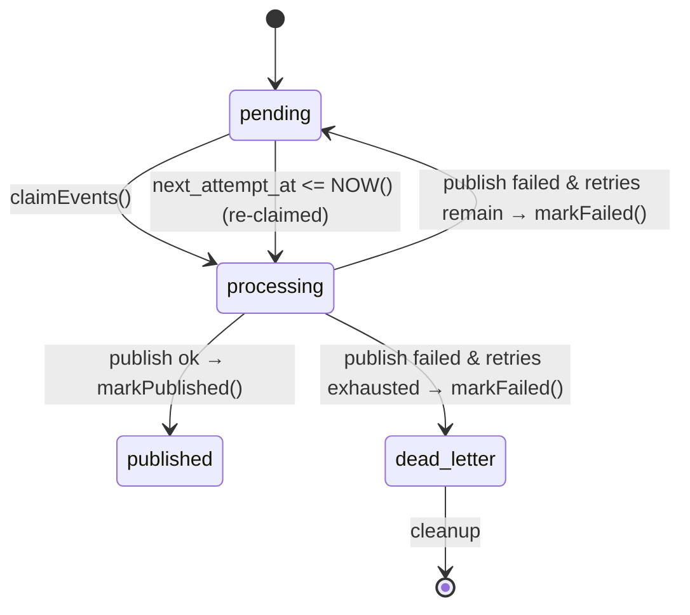
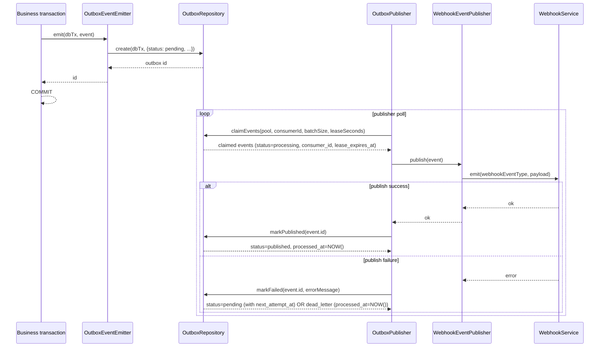

# Transactional Outbox Pattern

This module implements the transactional outbox pattern for reliable domain event publishing. It ensures that domain events are never lost, even when the event publishing mechanism fails.

## Problem

When publishing domain events directly after a database transaction commits, there's a race condition:

1. Transaction commits successfully
2. Application crashes before publishing event
3. Event is lost forever

This violates the guarantee that all state changes produce corresponding events.

## Solution

The transactional outbox pattern solves this by:

1. **Persisting events in the same transaction** as business state changes
2. **Publishing asynchronously** with a separate worker process
3. **Retrying failed publishes** with exponential backoff
4. **Maintaining ordering guarantees** per aggregate

## Architecture

```
┌─────────────────┐
│  Business Logic │
└────────┬────────┘
         │
         ▼
┌─────────────────┐      ┌──────────────┐
│   Transaction   │─────▶│ event_outbox │
│   (DB Commit)   │      │    table     │
└─────────────────┘      └──────┬───────┘
                                │
                                ▼
                         ┌──────────────┐
                         │   Outbox     │
                         │  Publisher   │
                         │   Worker     │
                         └──────┬───────┘
                                │
                                ▼
                         ┌──────────────┐
                         │   Webhook    │
                         │   Service    │
                         └──────────────┘
```

## Components

## Publish lifecycle (authoritative)

> This section is written to match the exact implementation in:
> - `src/db/outbox/emitter.ts` (emit-in-transaction contract)
> - `src/db/outbox/repository.ts` (atomic create/claim/mark + backoff + leasing)
> - `src/db/outbox/publisher.ts` (publisher loop)

### Emit contract (atomicity with business writes)

- `OutboxEventEmitter.emit(db, event)` calls `OutboxRepository.create(db, ...)` using the exact `db: Queryable` passed by the caller.

- `create()` performs a single `INSERT INTO event_outbox ...` with initial `status='pending'`.
- Because both the business write and the outbox insert use the same `db` client/transaction (`Queryable`), the outbox row is persisted **only if the surrounding transaction commits**.


### 1. Outbox Table (`event_outbox`)

**Source of truth:** `src/db/outbox/schema.ts` + `src/db/outbox/types.ts`

Stores domain events with metadata:


- `id`: Unique event identifier
- `aggregate_type`: Type of aggregate (e.g., "bond", "identity")
- `aggregate_id`: Aggregate instance identifier
- `event_type`: Event type (e.g., "bond.created")
- `payload`: Event data as JSONB
- `status`: Processing status (pending, processing, published, failed, dead_letter)
- `retry_count`: Number of publish attempts
- `max_retries`: Maximum retry attempts before marking as failed
 - `next_attempt_at`: When the event becomes eligible for the next retry (used for backoff)
- `created_at`: Event creation timestamp
- `processed_at`: When event was published or failed
- `error_message`: Last error message if failed

### 2. OutboxRepository

Provides database operations for outbox events:

- `create()`: Insert event in transaction
- `fetchPendingForProcessing()`: Get pending events with row-level locking
- `markPublished()`: Mark event as successfully published
- `markFailed()`: Mark event as failed and increment retry count
- `getByAggregate()`: Get events for specific aggregate (ordering)
- `cleanup()`: Remove old published/failed events
- `getStats()`: Get outbox statistics

### 3. OutboxPublisher

Background worker that polls for pending events and publishes them:

- Polls at configurable interval (default: 1 second)
- Processes events in batches (default: 100)
- Maintains ordering per aggregate
- Retries failed publishes with configurable max retries
 - Retries failed publishes with configurable max retries and exponential backoff
- Cleans up old events periodically

### 4. OutboxEventEmitter

Helper for emitting events within transactions:

```typescript
await outboxEmitter.emit(db, {
  aggregateType: 'bond',
  aggregateId: '123',
  eventType: 'bond.created',
  payload: { address: '0xabc', bondedAmount: '1000' }
})
```

## Usage

### 1. Emit Events in Transactions

```typescript
import { pool } from './db/pool.js'
import { outboxEmitter } from './db/outbox/emitter.js'

async function createBond(address: string, amount: string) {
  const client = await pool.connect()
  
  try {
    await client.query('BEGIN')
    
    // Business logic: insert bond
    const result = await client.query(
      'INSERT INTO bonds (identity_address, amount, ...) VALUES ($1, $2, ...) RETURNING id',
      [address, amount, ...]
    )
    
    // Emit event in same transaction
    await outboxEmitter.emit(client, {
      aggregateType: 'bond',
      aggregateId: result.rows[0].id,
      eventType: 'bond.created',
      payload: { address, bondedAmount: amount }
    })
    
    await client.query('COMMIT')
  } catch (error) {
    await client.query('ROLLBACK')
    throw error
  } finally {
    client.release()
  }
}
```

### 2. Start the Publisher Worker

```typescript
import { OutboxPublisher } from './db/outbox/publisher.js'
import { WebhookEventPublisher } from './db/outbox/webhookPublisher.js'
import { webhookService } from './services/webhooks/service.js'

const publisher = new OutboxPublisher(
  new WebhookEventPublisher(webhookService),
  {
    pollIntervalMs: 1000,
    batchSize: 100,
    cleanup: {
      publishedRetentionDays: 7,
      failedRetentionDays: 30
    },
    cleanupIntervalMs: 3600000 // 1 hour
  }
)

await publisher.start()
```

### 3. Configuration

The `OutboxPublisher` accepts an optional config object:

```typescript
const publisher = new OutboxPublisher(
  new WebhookEventPublisher(webhookService),
  {
    pollIntervalMs: 1000,
    batchSize: 100,
    leaseSeconds: 300,           // Lease duration (seconds) for claimed events
    heartbeatIntervalMs: 150000, // Heartbeat to renew lease (default: leaseSeconds * 1000 / 2)
    consumerId: 'my-publisher-1', // Unique ID for this instance (auto-generated if omitted)
    cleanup: {
      publishedRetentionDays: 7,
      failedRetentionDays: 30
    },
    cleanupIntervalMs: 3600000 // 1 hour
  }
)
```

You can also inject configuration via environment variables and build the config object in your app startup.

## Cleanup Policy

Old events are automatically cleaned up based on retention policy:

- **Published events**: Deleted after 7 days (configurable)
- **Failed events**: Deleted after 30 days (configurable)
 - **Dead-letter**: Events moved to `dead_letter` after exceeding `max_retries` are preserved until cleanup and can be inspected or reprocessed manually.

Backoff and dead-letter

- When a publish attempt fails, the publisher calls `OutboxRepository.markFailed(eventId, errorMessage)`.

- `markFailed()` always increments `retry_count` and sets:
  - `error_message = <last error>`
  - `consumer_id = NULL` and `lease_expires_at = NULL` (event is no longer owned)
  - `next_attempt_at = NULL` initially

- If the failure does **not** exhaust retries (`retryCount < max_retries` in the code path), it then sets backoff in two steps:

  - `delaySeconds = Math.min(Math.pow(2, retryCount), 3600)` — capped at one hour so a large `max_retries` budget can't produce a multi-day wait between attempts.
  - `next_attempt_at = NOW() + (delaySeconds || ' seconds')::interval`

- `error_message` is sanitized before being persisted (see `src/db/outbox/errorSanitizer.ts`):
  - known secret shapes (Stellar secret seeds, `Authorization`/`Bearer` headers, JWTs, `api_key=`/`token=`-style params, email addresses) are replaced with `[REDACTED]`
  - the result is truncated to 2000 characters (with a `...[truncated]` suffix) so an unbounded upstream error can't bloat the row or logs

- If retries are exhausted (`retry_count + 1 >= max_retries` in the SQL CASE), the row transitions to the terminal state:
  - `status = 'dead_letter'`
  - `processed_at = NOW()`
  - and the event remains in `dead_letter` until cleanup.

- Claiming (`OutboxRepository.claimEvents`) will only select rows whose backoff window is open:
  - `next_attempt_at IS NULL OR next_attempt_at <= NOW()`

- Crash recovery via leasing:
  - rows in `status='processing'` are reclaimable when `lease_expires_at IS NULL OR lease_expires_at < NOW()`.

- Ordering:
  - within a publisher batch, `OutboxPublisher` groups claimed events by `aggregateType:aggregateId` and processes each aggregate group sequentially.

## Publisher loop (lease → publish → ack/fail)

### State machine (exact status values)

The legal transition matrix is enforced by the repository entry points. A
transition method must target a `processing` row owned by the supplied
consumer; terminal, skipped, repeated, and stale-owner calls update zero rows
and fail without changing the event. The allowed edges are:

| Current status | Allowed next status |
| --- | --- |
| `pending` | `processing` |
| `processing` | `published`, `pending`, `dead_letter` |
| `published`, `failed`, `dead_letter` | none |

The publisher passes its consumer ID to idempotency-key, acknowledgement, and
failure operations. A failed transition is operationally actionable and must
be retried only after the row is claimed by the active consumer.



### Lease acquisition and claim

- The publisher uses a *consumer lease*:
  - `consumer_id` is set when claiming.
  - `lease_expires_at = NOW() + leaseSeconds`.
- Claim is crash-safe:
  - rows with `status='processing'` are reclaimable when `lease_expires_at IS NULL OR lease_expires_at < NOW()`.

### Backoff / retry eligibility

- Retrying is controlled by `next_attempt_at`:
  - claim selects rows where `next_attempt_at IS NULL OR next_attempt_at <= NOW()`.
- On failure, `OutboxRepository.markFailed()` clears ownership/lease and re-schedules via `next_attempt_at` (or moves to `dead_letter` when exhausted).

### Sequence diagram (emit → claim → publish → ack/fail)



## Metrics (exact)


The publisher conditionally emits these Prometheus metrics (only if `prom-client` is available):

- `outbox_dead_letter_total{error_code}`
  - incremented when `markFailed()` moves the row to `dead_letter`
  - `error_code` is derived from the first whitespace-delimited token of `errorMessage`, normalized to `[A-Z0-9_]` and truncated to 50 chars.

- `outbox_published_total{aggregate_type}`
  - incremented after `repository.markPublished()`.

- `outbox_failed_total{aggregate_type}`
  - incremented on any publish exception (before `markFailed()`).

- `outbox_pending_gauge`
  - set by `OutboxPublisher.scrapeMetrics()` from `repository.getStats().pending`.

- `outbox_lease_renew_total`
  - incremented when `renewLease()` successfully renews leases.

- `outbox_quarantine_total{reason}`
  - incremented when the publisher routes a “poison pill” event to outbox quarantine (reasons are the exact string union: `malformed_json | schema_invalid | oversized_payload | unknown_event_type`).


## DLQ and quarantine notes

- Outbox terminal failure is represented by `event_outbox.status = 'dead_letter'`.
- The outbox publisher also has a separate **quarantine** mechanism (`outbox_quarantine`) for “poison pill” events that cannot be published due to:
  - `malformed_json`
  - `schema_invalid`
  - `oversized_payload`
  - `unknown_event_type`
- Webhook delivery failures are stored in the webhook DLQ table `webhook_dlq` via `src/services/webhooks/postgresDlqStore.ts`.

## Monitoring


Get outbox statistics:

```typescript
const stats = await publisher.getStats()
console.log(stats)
// { pending: 5, processing: 2, published: 1000, failed: 3 }
```

Monitor these metrics:

- **Pending count**: Should be low (< 100). High values indicate publisher is falling behind
- **Failed count**: Should be low. High values indicate systemic publish failures
- **Processing count**: Should be low. High values indicate slow publish operations

## Testing

The module includes comprehensive tests:

- **Unit tests** (`repository.test.ts`): Test repository operations
- **Integration tests** (`integration.test.ts`): Test end-to-end scenarios:
  - Commit success + publish failure → eventual delivery
  - Max retries → mark as failed
  - Transaction rollback → event not persisted
  - Ordering guarantees per aggregate
  - Deduplication

Run tests:

```bash
npm test src/db/outbox
```

## Migration

To add the outbox table to an existing database:

```typescript
import { createOutboxSchema } from './db/outbox/schema.js'
import { pool } from './db/pool.js'

await createOutboxSchema(pool)
```

Or use the migration:

```bash
npm run migrate
```

## Refactoring Existing Code

Replace direct event emission:

```typescript
// Before
await webhookService.emit('bond.created', { address, bondedAmount })

// After (in transaction)
await outboxEmitter.emit(db, {
  aggregateType: 'bond',
  aggregateId: bondId,
  eventType: 'bond.created',
  payload: { address, bondedAmount }
})
```

See `webhookIntegrationOutbox.ts` for a complete example.
